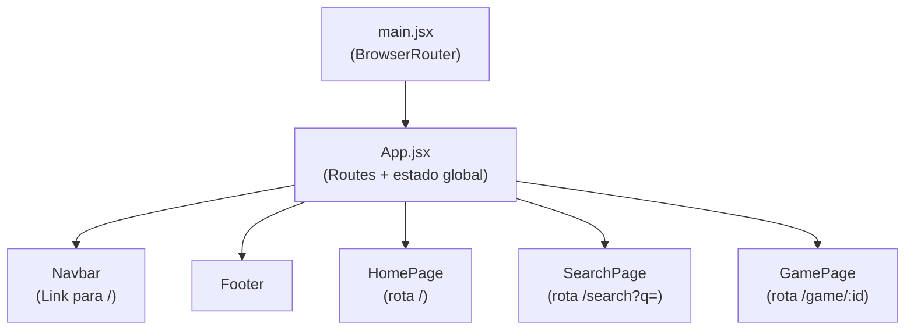
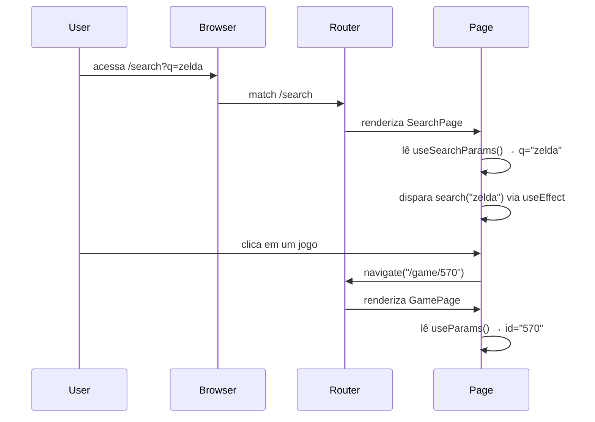

# Design Document — React Router Navigation

## Overview

O PlaySync atualmente gerencia toda a navegação via estado React (`hasSearched`, `selectedGame`) dentro do `App.jsx`. Isso impede compartilhamento de URLs, uso dos botões Voltar/Avançar do browser e acesso direto a rotas específicas.

Esta feature substitui a lógica condicional por React Router DOM com três rotas reais:
- `/` — HomePage
- `/search?q=` — SearchPage
- `/game/:id` — GamePage

O `BrowserRouter` já está presente em `main.jsx`. A mudança principal é mover a lógica de roteamento para dentro do `App.jsx` usando `<Routes>` e `<Route>`, e adaptar cada página para ler seu estado da URL em vez de props de estado.

---

## Architecture



### Fluxo de navegação



---

## Components and Interfaces

### App.jsx (refatorado)

Responsabilidades:
- Prover `<Routes>` com as três rotas
- Manter `<Navbar>` e `<Footer>` fora das rotas (presentes em todas as páginas)
- Manter o estado global de dados (`useGames`, `handleGameClick`, `adaptSteamData`)
- Remover `hasSearched` e `selectedGame` do estado de navegação
- Redirecionar rotas desconhecidas para `/` via `<Route path="*" element={<Navigate to="/" replace />} />`

```jsx
// Estrutura alvo do App.jsx
<div className="min-h-screen ...">
  <Navbar />
  <main className="...">
    <Routes>
      <Route path="/" element={<HomePage ... />} />
      <Route path="/search" element={<SearchPage ... />} />
      <Route path="/game/:id" element={<GamePage ... />} />
      <Route path="*" element={<Navigate to="/" replace />} />
    </Routes>
  </main>
  <Footer />
</div>
```

### Navbar.jsx (refatorado)

- Substituir `<button onClick={onReset}>` por `<Link to="/">` do React Router
- Remover a prop `onReset`

### HomePage.jsx

- Recebe `featured`, `trending`, `isLoading` como props do App
- Usa `useNavigate()` para navegar para `/game/:id` ao clicar em um jogo
- Usa `useNavigate()` para navegar para `/search?q=` ao submeter a SearchBar
- Mantém estado local de `searchTerm`

### SearchPage.jsx (refatorado)

- Lê `q` via `useSearchParams()`
- Usa `useEffect([q])` para disparar `onSearch(q)` automaticamente quando `q` muda
- Recebe `games`, `isLoading`, `error`, `onSearch`, `onGameClick` como props
- Usa `useNavigate()` para `/game/:id` ao clicar em resultado
- Atualiza a URL com `setSearchParams({ q: novoTermo })` ao submeter nova busca

### GamePage.jsx (refatorado)

- Lê `:id` via `useParams()`
- Usa `useEffect([id])` para disparar `onLoadGame(id)` ao montar
- Recebe `selectedGame`, `isLoading`, `onSearch` como props
- Exibe "Jogo não encontrado" com botão de voltar quando `selectedGame` é null após carregamento
- Usa `navigate(-1)` para o botão de voltar

---

## Data Models

Nenhum modelo de dados novo é introduzido. A feature apenas muda *de onde* o estado de navegação é lido — de variáveis React para a URL.

### Mapeamento URL → Estado

| URL | Componente | Fonte do estado |
|-----|-----------|-----------------|
| `/` | HomePage | `useGames().featured`, `useGames().trending` |
| `/search?q=zelda` | SearchPage | `useSearchParams()` → `q` |
| `/game/570` | GamePage | `useParams()` → `id` |

### Props interface do App → Pages

```
HomePage:   { featured, trending, isLoading, onGameClick }
SearchPage: { games, isLoading, error, onSearch, onGameClick }
GamePage:   { selectedGame, isLoading, onSearch, onLoadGame }
```

### Configuração Vite (SPA fallback)

O Vite já serve o `index.html` como fallback por padrão em modo dev. Para tornar explícito:

```js
// vite.config.js
export default defineConfig({
  plugins: [react()],
  server: {
    historyApiFallback: true,
  },
})
```

### Configuração Vercel

O `vercel.json` já contém a regra de rewrite `"/(.*)" → "/"`, cobrindo o requisito 7.2.


---

## Correctness Properties

*A property is a characteristic or behavior that should hold true across all valid executions of a system — essentially, a formal statement about what the system should do. Properties serve as the bridge between human-readable specifications and machine-verifiable correctness guarantees.*

### Property 1: Rotas desconhecidas redirecionam para /

*Para qualquer* caminho de URL que não seja `/`, `/search` ou `/game/:id`, navegar para esse caminho deve resultar na renderização da `HomePage` e na URL sendo `/`.

**Validates: Requirements 1.2**

---

### Property 2: Navbar e Footer presentes em todas as rotas

*Para qualquer* rota válida (`/`, `/search`, `/game/:id`), o componente `Navbar` e o componente `Footer` devem estar presentes no DOM renderizado.

**Validates: Requirements 1.3**

---

### Property 3: Busca em qualquer página navega para /search?q=

*Para qualquer* termo de busca não vazio submetido via `SearchBar` (seja na `HomePage`, `SearchPage` ou `GamePage`), a URL resultante deve ser `/search?q={termo}`.

**Validates: Requirements 2.3, 4.5**

---

### Property 4: Clique em jogo navega para /game/{id}

*Para qualquer* jogo clicado em uma listagem (`HomePage` ou `SearchPage`), a URL resultante deve ser `/game/{id}` onde `id` corresponde ao identificador do jogo clicado.

**Validates: Requirements 2.4, 3.5**

---

### Property 5: SearchPage dispara busca automaticamente para qualquer q não vazio

*Para qualquer* valor não vazio do query param `q` ao montar a `SearchPage`, a função de busca deve ser chamada exatamente uma vez com esse valor como argumento.

**Validates: Requirements 3.2**

---

### Property 6: Submissão na SearchPage atualiza o query param q

*Para qualquer* novo termo submetido na `SearchBar` dentro da `SearchPage`, o query param `q` na URL deve ser atualizado para o novo termo e uma nova busca deve ser disparada.

**Validates: Requirements 3.4**

---

### Property 7: GamePage usa o :id da URL para carregar o jogo

*Para qualquer* valor de `:id` presente na URL `/game/:id`, a `GamePage` deve chamar a função de carregamento com exatamente esse `id` como argumento.

**Validates: Requirements 4.2**

---

### Property 8: Navegação entre rotas preserva o histórico

*Para qualquer* sequência de navegações entre `/`, `/search` e `/game/:id`, cada navegação deve adicionar uma entrada ao histórico do browser (exceto quando `replace` é usado explicitamente), de modo que `navigate(-1)` retorne à rota anterior.

**Validates: Requirements 6.3**

---

## Error Handling

### Rota não encontrada
- `<Route path="*" element={<Navigate to="/" replace />} />` captura qualquer URL inválida e redireciona para `/` sem adicionar entrada no histórico.

### GamePage — jogo não encontrado
- Quando `onLoadGame(id)` falha ou retorna null, a `GamePage` exibe a mensagem "Jogo não encontrado" e um botão de voltar.
- O botão chama `navigate(-1)`, retornando à página anterior.

### SearchPage — busca com erro
- Quando `onSearch(q)` rejeita, a `SearchPage` exibe a mensagem de erro recebida.
- A URL permanece em `/search?q={termo}` — nenhuma navegação adicional ocorre.

### SearchPage — q ausente ou vazio
- Quando `/search` é acessado sem `q` ou com `q=""`, nenhuma busca é disparada e a `SearchBar` é exibida vazia.

---

## Testing Strategy

### Abordagem dual

Testes unitários e testes baseados em propriedades são complementares e ambos necessários:

- **Testes unitários**: verificam exemplos específicos, casos de borda e condições de erro
- **Testes de propriedade**: verificam propriedades universais sobre todos os inputs possíveis

### Biblioteca de testes

- **Framework**: [Vitest](https://vitest.dev/) + [React Testing Library](https://testing-library.com/docs/react-testing-library/intro/)
- **Property-based testing**: [fast-check](https://fast-check.io/) — biblioteca madura para JavaScript/TypeScript
- Configuração mínima de **100 iterações** por teste de propriedade

### Testes unitários (exemplos e casos de borda)

Cobrem os critérios marcados como `yes - example` e `edge-case` no prework:

| Teste | Requisito |
|-------|-----------|
| App renderiza exatamente 3 Routes | 1.1 |
| Navegar para `/` renderiza HomePage | 2.1 |
| HomePage exibe hero, SearchBar, FeaturedGame, TrendingSection | 2.2 |
| Navegar para `/search?q=test` renderiza SearchPage | 3.1 |
| `/search` sem `q` não dispara busca | 3.3 (edge-case) |
| Busca com erro mantém URL em `/search` e exibe mensagem | 3.6 (edge-case) |
| Navegar para `/game/570` renderiza GamePage | 4.1 |
| Jogo não encontrado exibe mensagem e botão de voltar | 4.3 (edge-case) |
| Botão de voltar na GamePage chama navigate(-1) | 4.4 |
| Clicar no logo da Navbar navega para `/` | 5.1 |
| Navbar usa `<Link>` do React Router | 5.2 |
| vite.config.js contém historyApiFallback | 7.1 |
| vercel.json contém rewrite `/(.*) → /` | 7.2 |

### Testes de propriedade

Cada propriedade do design deve ser implementada por **um único** teste de propriedade com fast-check:

```js
// Exemplo de estrutura — Property 1
// Feature: react-router-navigation, Property 1: unknown routes redirect to /
fc.assert(
  fc.asyncProperty(fc.string({ minLength: 1 }).filter(s => !['/', '/search'].includes(s) && !s.startsWith('/game/')), async (path) => {
    // render App with MemoryRouter at path
    // assert: current location is / and HomePage is rendered
  }),
  { numRuns: 100 }
);
```

| Teste de propriedade | Propriedade | Requisito |
|---------------------|-------------|-----------|
| Rotas desconhecidas → `/` | Property 1 | 1.2 |
| Navbar+Footer em todas as rotas | Property 2 | 1.3 |
| Busca em qualquer página → `/search?q=` | Property 3 | 2.3, 4.5 |
| Clique em jogo → `/game/{id}` | Property 4 | 2.4, 3.5 |
| SearchPage auto-busca com q não vazio | Property 5 | 3.2 |
| Submissão na SearchPage atualiza q | Property 6 | 3.4 |
| GamePage usa :id para carregar | Property 7 | 4.2 |
| Navegação preserva histórico | Property 8 | 6.3 |

**Tag format para cada teste**: `// Feature: react-router-navigation, Property {N}: {property_text}`
